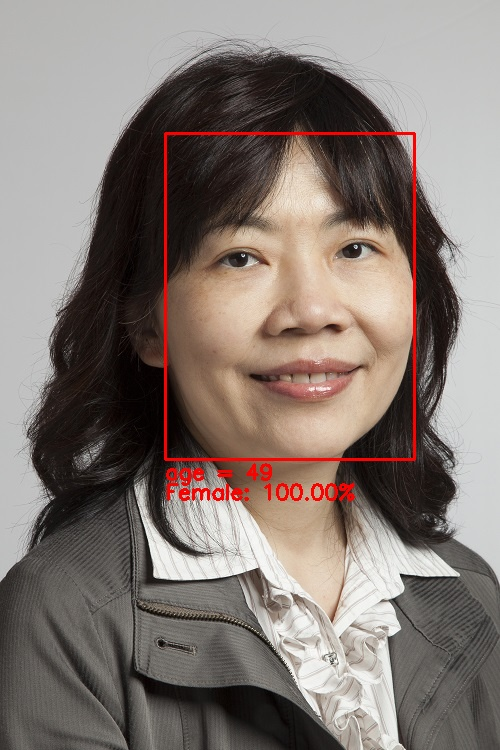
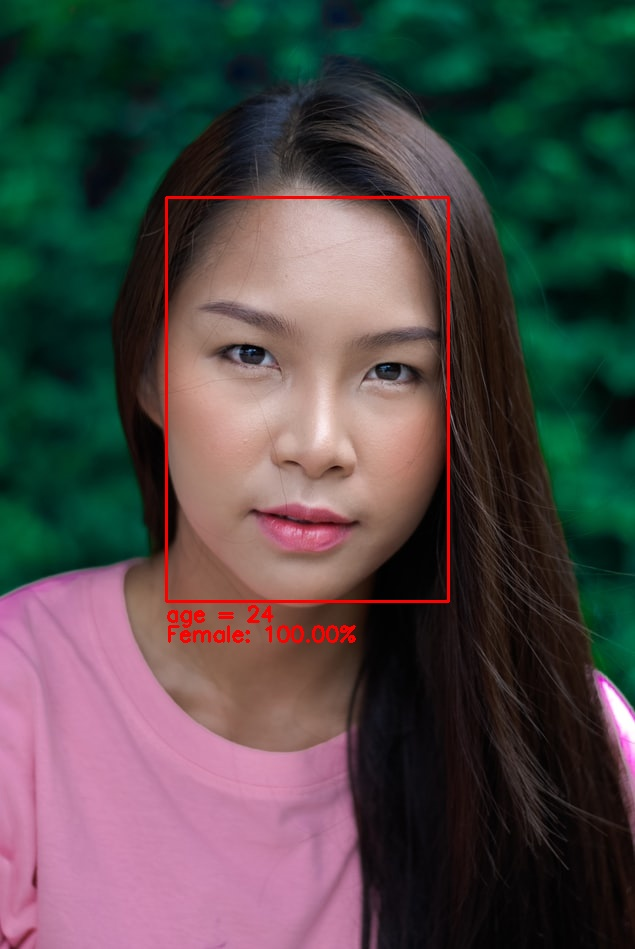
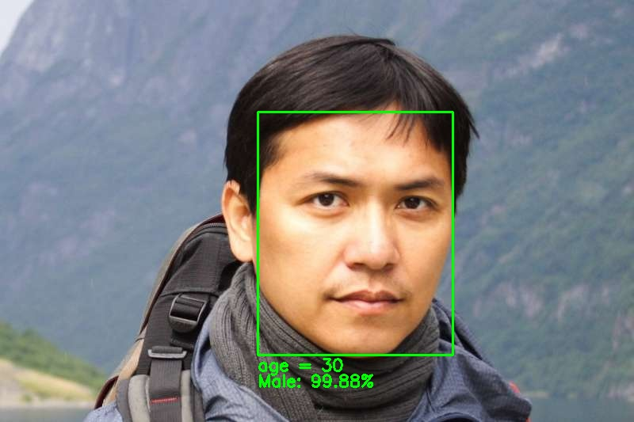
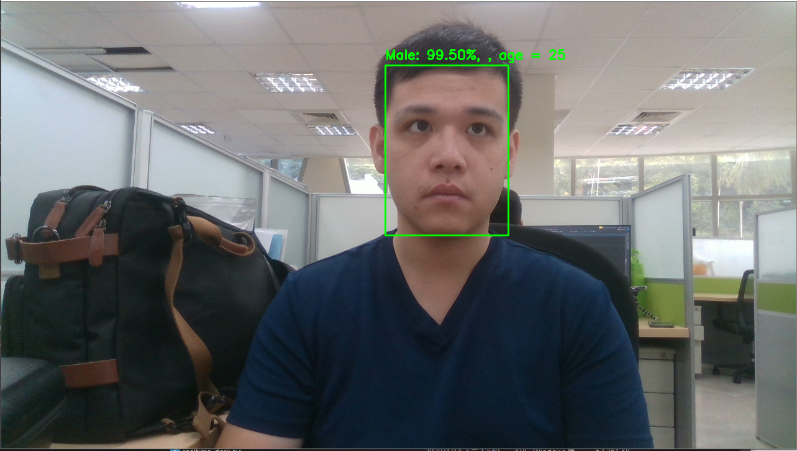
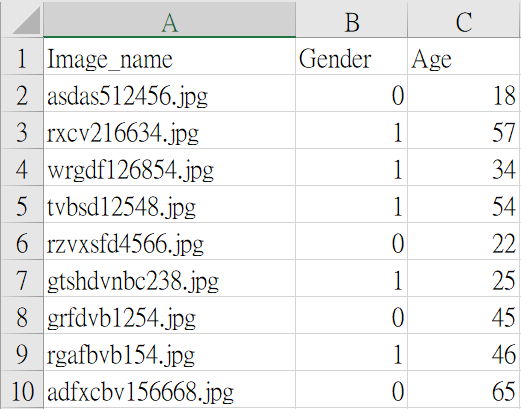
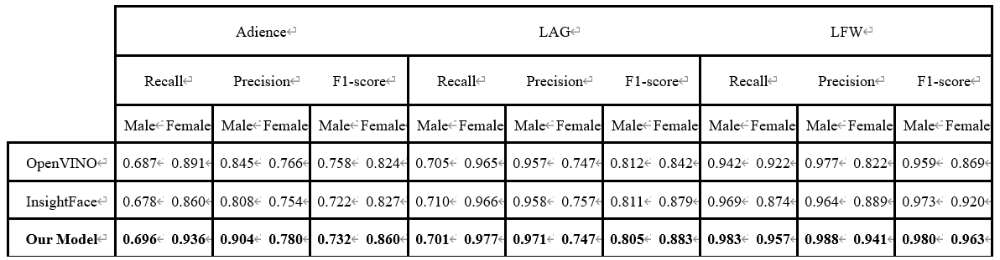
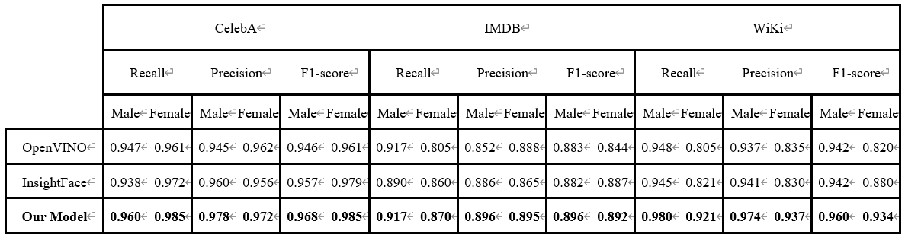
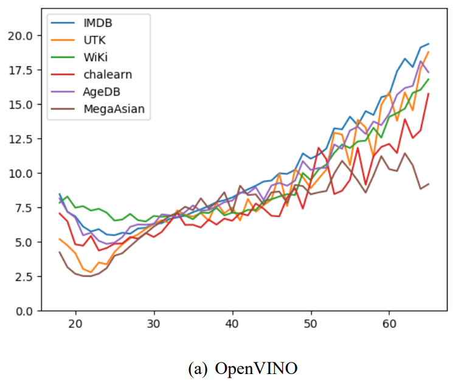
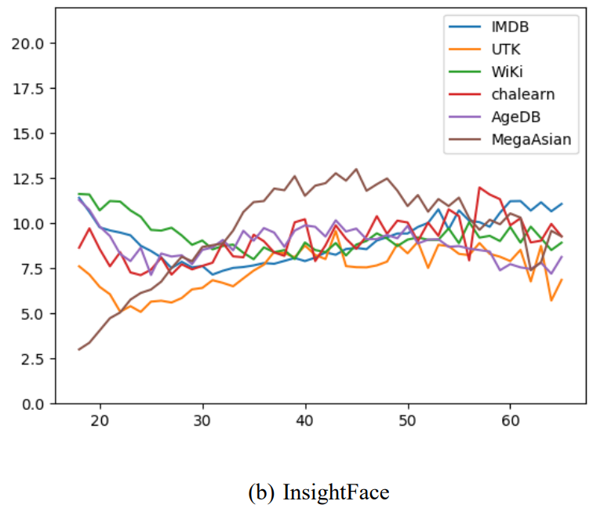
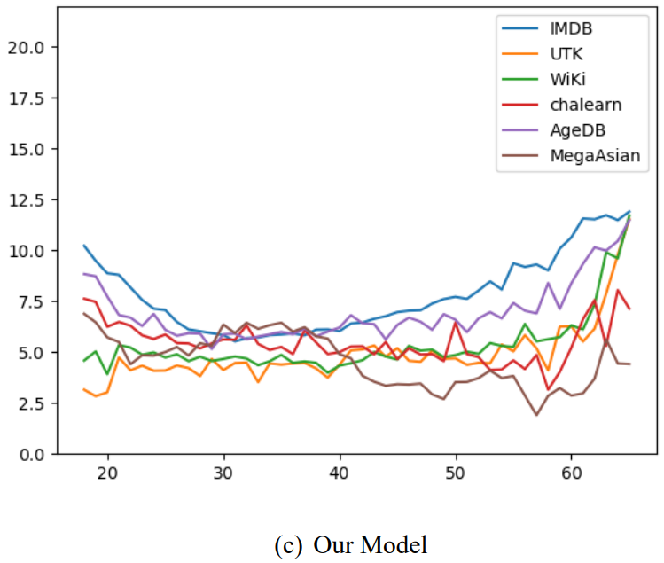

# High Speed Real-Time Face-Age-Gender-Recognition
+ A real-time age and gender recognition of face model with only 1mb, 0.531×10^6 parameters and 0.074 GFLOPs.
+ Using OpenVINO to accelerate the speed of real-time recognition on intel D415.
+ The backbone of model structure is MobileFaceNet.
+ CelebA, AFAD, MegaAge-Asian and UTKFace dataset is used for model training.

**Code Author: Vaan Lin**

**Last update: 2020/07/08**
### Face image inference demo

​
​
​

### Real-time webcam(intel D415) demo
​
​


## Requirements
Please install Anaconda(Python 3.7 64-Bit) first.
#### NVIDIA
+ CUDA            10.1
+ cudnn           7.6.4
#### Python
+ Tensorflow-GPU  2.2.0
+ Keras           2.3.1
+ cvlib           0.2.2
+ numpy           1.17.4

You can install the package of above at once by using command: 
```
pip install -r requirements.txt
```
#### OpenVINO     
+ OpenVINO        2020.3

## Dependencies
+ Anaconda
+ MobileFaceNet
(https://arxiv.org/ftp/arxiv/papers/1804/1804.07573.pdf)
+ cvlib
(https://github.com/arunponnusamy/cvlib)

## Datasets
If you wanna use your datasets to train on my model, please notice the following:
1. This model is for age and gender recognition, so make sure your dataset can be labeled like:

​

2. When you have already prepared your label.csv, put your images at 
```
.\FaceAgeGenderRecognition\Datasets and you can generate TFRecors by executing gen_TFRecords.py
```
3. The results of TFRecords will save at 
```
.\FaceAgeGenderRecognition\TFRecords_Create\TFRecords\train(or test)
```

## Simple Steps of Execution
Insure you have already installed OpenVINO.
+ If you wanna use the model to inference your images

1. Put your images in 
```
.\FaceAgeGenderRecognition\Demo\Image\Demo_Image
```
2. Double click run_Image_Demo.bat
3. The results will be saved in 
```
.\FaceAgeGenderRecognition\Demo\Image\Results
```

+ If you wanna use the model to achieve the real-time recognition on intel D415

1. Double click run_Webcam_Demo.bat

+ If you want to re-train the model of using your dataset of TFRecords

1. Double click run_MFN_Train.bat

## Command of Code Execution
Insure you have already installed OpenVINO.
+ If you wanna use the model to inference your images
1. Activate your Anaconda environment
2. Put your images in 
```
.\FaceAgeGenderRecognition\Demo\Image\Demo_Image
```
3. Executed by python: 
```
python ./Demo/Image/Image_Test.py --x ./Training/Results/Openvino_IR/MFN.xml --b ./Training/Results/Openvino_IR/MFN.bin --i ./Demo/Image/Demo_Image --o ./Demo/Image/Results/

--x means path of OpenVINO .xml file
--b means path of OpenVINO .bin file
--i means path of input images
--o means path of output images
```
+ If you wanna use the model to achieve the real-time recognition on intel D415
1. Activate your Anaconda environment
2. Executed by python: 
```
python ./Demo/RealTime/Webcam.py --x ./Training/Results/Openvino_IR/MFN.xml --b ./Training/Results/Openvino_IR/MFN.bin --r 1280

--x means path of OpenVINO .xml file
--b means path of OpenVINO .bin file
--r means the resolution of D415(include 1920(1920x1080), 1280(1280x720) and 960(960x540))
```

+ If you want to create the tfrecords by yourself
1. Activate your Anaconda environment
2. Executed by python(Asian):
```
python ./TFRecords_Create/gen_TFRecords.py --i ./FaceAgeGenderRecognition/Datasets/Asian_FaceData/ --c ./TFRecords_Create/Asian_FaceData.csv --t ./TFRecords_Create/TFRecords --n Asian

--i means the path of dataset
--c means the path of csv file
--t means the path of output tfrecords
--n means the name of output tfrecords
```

+ If you want to re-train the model of using your dataset of TFRecords
1. Activate your Anaconda environment
2. cd ./FaceAgeGenderRecognition/Training
3. Executed by python:
```
python MFN_Train.py --tn ./FaceAgeGenderRecognition/Outputs/TFRecords/test/ --m .././Model/Backbone/MFN_62_075_gender_pre-trained.h5 --p Y

--tn means path of training tfrecords
--ts means path of testing tfrecords
--m  means the path of model
--p  means If use pre-trained model or not
```

## Training Details
All of training details you can check the document named FaceAgeGenderRecognition.pdf.

## Results
#### Compared with OpenVINO and InsightFace
+ Gender

​
​

+ Age

Results of (a) OpenVINO, (b) InsightFace and (c) Our Model age estimation. X-axis means range of age from 18 to 65, and y-axis means the mean absolute error (MAE) of model estimation in every age.

​
​
​
